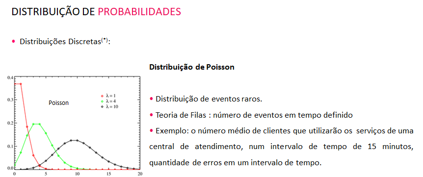
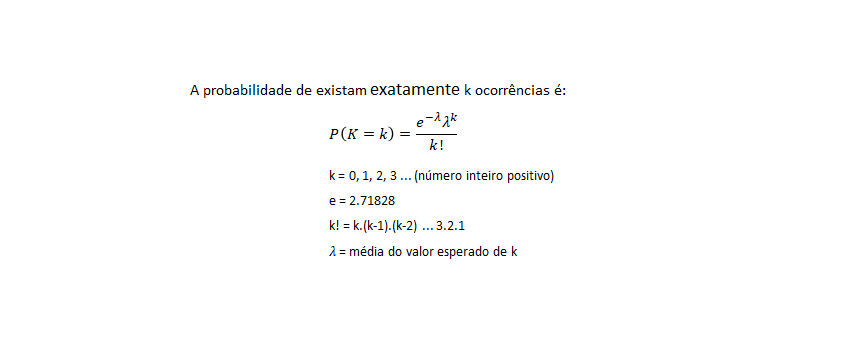

```{r setup, include=FALSE}
knitr::opts_chunk$set(echo = TRUE)
```


#### R Markdown

This is an R Markdown document. Markdown is a simple formatting syntax for authoring HTML, PDF, and MS Word documents. For more details on using R Markdown see <http://rmarkdown.rstudio.com>.

When you click the **Knit** button a document will be generated that includes both content as well as the output of any embedded R code chunks within the document. You can embed an R code chunk like this:


```{r}


################## GERACAO NUMEROS ALEATORIOS ##################

amostra_1000<-runif(1000,0,1)

# amostra_1000


```

```{r}
summary(amostra_1000)

hist(amostra_1000)

system.time(amostra_1000<-runif(1000,0,1))


```

```{r}
amostra_100000<-runif(100000,0,1)
# amostra_100000
summary(amostra_100000)
hist(amostra_100000)
system.time(amostra_100000<-runif(100000,0,1))

```

```{r}
amostra_100000000<-runif(100000000,0,1)

summary(amostra_100000000)

system.time(amostra_100000000<-runif(100000000,0,1))

hist(amostra_100000000)

```

```{r}


################## GERACAO DE NUMEROS NO R ##################

#Gerando de numeros da megasena
# Effective way of generating 6 numbers to Megasena lottery


 megasena <-  as.data.frame(t(replicate(sort(sample(1:60, 6, replace = FALSE)), 
                                           n = 1000)))


summary(megasena)
 
```
#### VARIÁVEL ALEATÓRIA

#####  Variável aleatória - é uma variável cujo valor é um resultado numérico, associado ao resultado de uma experiência aleatória. É a expressão matemática de eventos sujeitos à variação natural (do acaso), seus resultados são expressos por conjuntos de um espaço amostral, e possuirá sempre uma distribuição de probabilidade.

#####  Distribuição de probabilidades (ou modelo de probabilidade) de uma variável aleatória é um modelo matemático que se idealiza para estudar o fenómeno aleatório em causa


###  Distribuições Amostrais

```{r}  

# distribuição gaussiana em R:
# dnorm(x, mean = 0, sd = 1, log = FALSE)
# pnorm(q, mean = 0, sd = 1, lower.tail = TRUE, log.p = FALSE)
# qnorm(p, mean = 0, sd = 1, lower.tail = TRUE, log.p = FALSE)
# rnorm(n, mean = 0, sd = 1)
# onde:
# d- densidade: a fdp
# p- probabilidade: a função de distribuição cumulativa
# q- quartis: inverso da função de distribuição cumulativa
# r- random: gera variáveis aleatórias com essa distribuição

# densidade de probabilidades

set.seed(8)

x = seq(-4, 4, by = .1)
plot(x,dnorm(x,mean=0,sd=1),main="fdp gaussiana",type="l")

 
```

```{r}  


# distribuição cumulativa
# a função pnorm(x) retorna a função de distribuição cumulativa da gaussiana, ∫x−∞P(x′)dx′

plot(x,pnorm(x,mean=0,sd=1),main="distribuição cumulativa da gaussiana",type="l")


```

```{r}  
# percentil da distribuição cumulativa
# qnorm é o inverso de pnorm e fornece o falor de x correspondente ao percentil p da distribuição normal

p = seq(0, 1, by = .01)
x = qnorm(p)
plot(p,x,main="qnorm",type="l")


```

```{r}  
# geração de números aleatórios
# rnorm gera um vetor com números distribuídos como uma gaussiana

hist(rnorm(100,mean=10,sd=5))
```

```{r}  
x<-seq(-3,3,0.1) # Cria um intervalo de -3 a 3
fdnorm<-dnorm(x = x, mean = 0, sd=1)    # Calcula a fdp da distr. normal para o intervalo x
fdanorm<-pnorm(q = x, mean = 0, sd=1)   # Calcula a fda da distr. normal para o intervalo x

## Imprimindo os gráficos da fdp e fda:
## fdp: função densidade e fda: distribuição acumulada de uma v.a. Normal padrão.
par(mfrow=c(1,2))
plot(x=x,y=fdnorm,type="l", col="blue",lwd=2, main="f.d.p. da Distrib. Normal padrão",xlab="z")
plot(x=x,y=fdanorm,type="l", col="blue",lwd=2, main="f.d.a. da Distrib. Normal padrão",xlab="z")
lines(x=c(0,0),y=c(0,fdanorm[x==0]),lty=2, col="gray")

par(mfrow=c(1,1))


```

```{r}

################## DISTRIBUICAO NORMAL ##################

# O tempo gasto no exame vestibular tem distribuicao Normal 
# com media 120 min e desvio padrao 15 min.

#Simular um histograma com n=1000 com a distribuicao fornecida do tempo de prova dos alunos 

tempo<-rnorm(10000,mean=120,sd=15)
mean(tempo)
sd(tempo)
hist(tempo, col = "orange")

```

```{r}

tempo_pad <- scale(tempo)

par(mfrow=c(1,2))

hist(tempo, col = "blue")
hist(tempo_pad, col = "green")

par(mfrow=c(1,1))

```


```{r}


# Sorteando-se um aluno ao acaso, qual a probabilidade dele terminar o exame 
# antes de 100 min?
 

prob <-pnorm(100,mean=120, sd=15)
cat("Probabilidade de um aluno terminar o exame antes de 100min",prob*100, '% \n')
 

```
#### Vamos ver isso no gráfico

```{r}

par(mfrow=c(1,2))
# grafico 1
curve(pnorm(x, 120, 15), from=50, to=200, ylim=c(0,1), xlab="x", ylab=expression(P(X <= x)),col= 1, lwd = 3,yaxs="i", main=c(paste("Distribuição Acumulada para"),paste("X ~ N(120,225)")))
lines(x=c(100,100),y=c(0, pnorm(100,120,15)),lty=2, col="darkred")
lines(y=rep(pnorm(100,120,15),2),x=c(0,100),lty=2,col="darkred") 
mtext(100,side=1, at=100, col="darkred")
mtext(round(pnorm(100,120,15),4), side=2, at=pnorm(100,120,15), col="darkred" )
# gráfico 2
curve(dnorm(x, 120, 15), xlim=c(50,200), ylim=c(0,dnorm(120,120,15)*1.1), xlab="x", ylab = "Densidade de Probabilidade" ,col= 1, lwd = 3,yaxs="i", main =c(paste("Função Densidade de Probabilidade"),paste("de X ~ N(120,225)"))) 
mtext(100,side=1, at=100, col="darkred")
x=c(0,seq(50,100,0.01),100)
y=c(0,dnorm(seq(50,100,0.01),120,15),0)
polygon(x=x,y=y,col="darkred")
legend("topright",legend=expression(P(X <= 100)),  fill="darkred")


```


```{r}

# Sorteando-se um aluno ao acaso, qual a probabilidade dele terminar o exame 
# com mais de 100 min?

prob <-pnorm(100,mean=120, sd=15, lower.tail = FALSE)
cat("Probabilidade de um aluno terminar o exame com mais de  100min",prob*100, '% \n')


```

```{r}

# Qual a proporcao esperada de alunos terminarem  entre 100min e 140min?


print("opçao 1:proporcao esperada de alunos terminarem  entre 100min e 140min")


par(mfrow=c(1,3))


# grafico 1
curve(dnorm(x, 120, 15), xlim=c(50,200), ylim=c(0,dnorm(120,120,15)*1.1), xlab="x", ylab = "Densidade de Probabilidade" ,col= 1, lwd = 3,yaxs="i", main=expression(P(X <= 140))) 
x=c(50,seq(50,140,0.01),140)
y=c(0,dnorm(seq(50,140,0.01),120,15),0)
polygon(x=x,y=y,col="red")


# grafico 2
curve(dnorm(x, 120, 15), xlim=c(50,200), ylim=c(0,dnorm(120,120,15)*1.1), xlab="x", ylab = "Densidade de Probabilidade" ,col= 1, lwd = 3,yaxs="i", main=expression(P(X <= 100))) 
x=c(50,seq(50,100,0.01),100)
y=c(0,dnorm(seq(50,100,0.01),120,15),0)
polygon(x=x,y=y,col="orange")


# grafico 3

curve(dnorm(x, 120, 15), xlim=c(50,200), ylim=c(0,dnorm(120,120,15)*1.1), xlab="x", ylab = "Densidade de Probabilidade" ,col= 1, lwd = 3,yaxs="i", main=expression(P(paste(100 <=X ) <= 140))) 
x=c(100,100,seq(100,140,0.01),140)
y=c(0,dnorm(100,120,15),dnorm(x=seq(100,140,0.01),120,15),0)
polygon(x=x,y=y,col="darkred")


par(mfrow=c(1,1))

```

#### Calculando:

```{r}


# Qual a proporcao esperada de alunos terminarem  entre 100min e 140min?


print("opçao 1:proporcao esperada de alunos terminarem  entre 100min e 140min")

pnorm(140,mean=120, sd=15)-pnorm(100,mean=120, sd=15)

# ou


print("opçao 2:proporcao esperada de alunos terminarem  entre 100min e 140min")

diff(pnorm(c(100,140),mean=120,sd=15))

```


```{r}
# Qual deve ser o tempo de prova, de modo a permitir que 95% dos vestibulandos 
# terminem no prazo estipulado?

print("tempo de prova em min de modo a permitir que 95%")
print("dos vestibulandos terminem no prazo estipulado")
qnorm(0.95,mean=120, sd=15)


pnorm(144.7,mean=120,sd=15) #Prova real para ver se deu certo

```


####   DISTRUIBUICAO DE PROBABILIDADES  






```{r}

# DISTRIBUIÇÃO DE POISSON
# probabilidade de n eventos ocorrerem num certo intervalo de tempo, ou em certa região do espaço, se estes eventos ocorrem independentemente e com uma média fixa λ:


#Uma loja vende 5 camisas todos os dias, entao qual a probabilidade de vender hoje:


print("Probabilidade de exatamente 3 camisas") 
dpois(x = 3, lambda = 5)


# ou 


print("Probabilidade de exatamente 3 camisas")
ppois(2, lambda=5, lower=FALSE) - ppois(3, lambda=5, lower=FALSE) #Probabilidade de exatamente 3 camisas


print("Probabilidade de 4 ou mais camisas")
ppois(3, lambda=5, lower=FALSE) #Probabilidade de 4 ou mais camisas

print("Probabilidade de 3 ou menos camisas")
ppois(3, lambda=5) #Probabilidade de 3 ou menos


p= dpois(0:10, lambda = 5)
names(p)=0:10
barplot(p,  col= c(rep('forestgreen',6), rep('grey',7)), main = expression(paste("Poisson (", lambda, " = 5)")), xlab = "k", ylab = "P(X=k)")


```

```{r}
#Se doze carros em media cruzam uma ponte por minuto, qual a probabilidade de ter 17 carros
#ou mais cruzando a ponte por minuto?

print("Probabilidade de de 17 ou mais carros cruzando a ponte por minuto")
ppois(16, lambda=12, lower=FALSE) #Probabilidade de 17 ou mais carros


```
