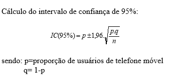

```{r setup, include=FALSE}
knitr::opts_chunk$set(echo = FALSE)
```


```{r pacotes}
library(tidyverse)
library(summarytools)
```


### Importar a base de cadastro

```{r dados, warning=FALSE, resuts='hide', message=FALSE}
library(readr)
df <- read_csv("Arq_Empresa_XYZ.csv")

```


## Conhecer a população
### Tabela de frequencia da variavel sexo na populacao
```{r sexop, warning=FALSE, resuts='hide', message=FALSE}
freq(df$Sexo)
```


### Calcular a media da idade da populacao

```{r idadep, warning=FALSE, resuts='hide', message=FALSE}
summary(df$idade)
```

### Calcular a media de anos de estudo da populacao

```{r escolaridadep, warning=FALSE, resuts='hide', message=FALSE}
summary(df$Anos_estudo)
```


### Sortear uma amostra aleatoria de tamanho 40


```{r  sorteio da amostra, warning=FALSE, resuts='hide', message=FALSE}
set.seed(123)
amostra <- df[sample(1:nrow(df),40, replace = FALSE),]
```


## Conhecer a amostra

### Tabela de frequencia da variavel sexo na amostra
```{r sexoa, warning=FALSE, resuts='hide', message=FALSE}
freq(amostra$Sexo)
```

### Calcular a idade media da amostra

```{r idadea, warning=FALSE, resuts='hide', message=FALSE}
summary(amostra$idade)
```

### Calcular a media de anos de estudo da amostra

```{r descritiva amostra, warning=FALSE, resuts='hide', message=FALSE}
summary(amostra$Anos_estudo)
```





### Calcular a proporcao de clients com telefone movel na amostra

```{r prop, warning=FALSE, resuts='hide', message=FALSE}
nobs <- nrow(amostra)
tem_telefone <- ifelse(amostra$Telefone_movel == 2,1,0)
soma <- sum(tem_telefone)
proporcao <- soma/nobs
proporcao
```

```{r erropadrao, warning=FALSE, resuts='hide', message=FALSE}
ep <- sqrt(proporcao*(1-proporcao)/nobs)
ep
```

#### Calculo do Intervalo de Confianca de 95% para a proporcao

```{r ic95, warning=FALSE, resuts='hide', message=FALSE}
limite_inferior <- proporcao - 1.96*ep
limite_inferior

limite_superior <- proporcao + 1.96*ep
limite_superior


```
### Interpretacao do IC95%

```{r }

cat("A proporcao de clientes com telefone movel na populacao
esta entre:", '\n'," limite inferior:",limite_inferior,'\n', " limite superior:" ,limite_superior)


```


