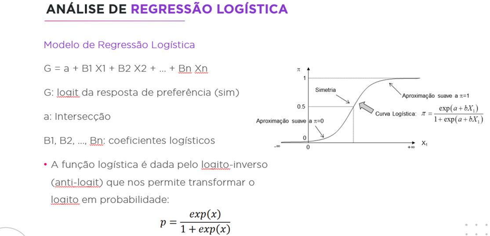
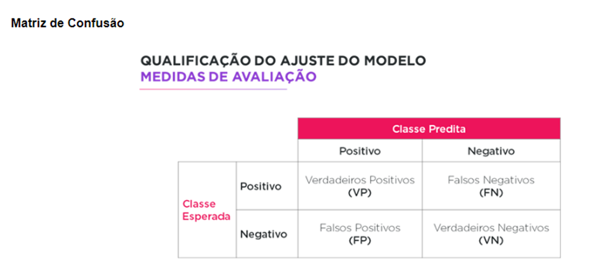

```{r setup, include=FALSE}
knitr::opts_chunk$set(echo = TRUE)
```

## R Markdown

This is an R Markdown document. Markdown is a simple formatting syntax for authoring HTML, PDF, and MS Word documents. For more details on using R Markdown see <http://rmarkdown.rstudio.com>.

When you click the **Knit** button a document will be generated that includes both content as well as the output of any embedded R code chunks within the document. You can embed an R code chunk like this:

#### Objetivo: Estimar a chance de um cliente de cartão de crédito ativo  
#### Ficar Inadimplente
#### Tecnicas Supervisionadas de Classificao.


```{r }

# Leitura da Base
 

Base_Inad <- read.csv("Inadimplencia_quantitativa_2.csv", row.names=1, sep=";", stringsAsFactors=TRUE)


# avaliando o nome e o formato das variáveis
str(Base_Inad )


```

```{r}
# analise descritiva:  sumarizacao das variaveis
summary(Base_Inad)


```

```{r}
# Dependendo da tecnica podemos utilizar variaveis preditoras numericas ou categoricas,  
# somente a variavel target que deve ser categorica

# Transformando a variavel target em categorica
Base_Inad$Resposta <- factor(Base_Inad$Resposta)

# Quntidade de observacoes por evento (variavel target)
summary(Base_Inad$Resposta)

# Proporcao observacoes por evento (variavel target)
prop.table(table(Base_Inad$Resposta))

# Vejam que a amostra eh balanceada, isto eh, os dois grupos tem 50% de individuos.

```

```{r}
# Etapa de analise descritiva das variaveis. 
# 
# Deve ser feita com o foco no evento de interesse:   
#
# A variavel preditora versus variável target   
#
# No caso de Variáveis quantitativas     

attach( Base_Inad)

boxplot(Atrasos~Resposta,col=c('orange','blue'), range=3)

boxplot(RendaMensal~Resposta ,col=c('orange','blue'), range=3)

boxplot(TempoRel~Resposta ,col=c('orange','blue'), range=3)

boxplot(GastosAlim~Resposta,col=c('orange','blue'), range=3)

boxplot(valorFatura~Resposta,col=c('orange','blue'), range=3)


```

```{r}

# continuando com analise descritiva: A variavel preditora versus variavel target   
#
# Variáveis qualitativa ou categorica     

# Frequencia relativa - column percentages - cada coluna soma 100% 


print(prop.table(table(RegRisc,Resposta),2 ),digits=2)


plot(RegRisc , as.factor(Resposta),ylab="Resposta",xlab="Regiao do Cliente",col=c('Red','darkgreen'))

```


```{r}
# Fazendo tratamento nas variaveis e excluindo outliers.

#  Criar variaveis dicotomicas(one-hot-encoding):
Base_Inad$RegCli_I <- ifelse(Base_Inad$RegRisc=="I",1,0)   
Base_Inad$RegCli_II <- ifelse(Base_Inad$RegRisc=="II",1,0)   
Base_Inad$RegCli_III <- ifelse(Base_Inad$RegRisc=="III",1,0)   
Base_Inad$RegCli_IV <- ifelse(Base_Inad$RegRisc=="IV",1,0)  


```
 
```{r}

# criando variaveis dummies x ONE-HOT-Encoding

library(caret)

# selecionando as variáveis que precisam ser transformadas em dummys

dados_categ <- subset(Base_Inad, select=c(RegRisc))

str(dados_categ)

```
 
```{r}
# transformando a variável em categórica antes 
# dados_categ$Var_a <- as.factor(dados_categ$Var_a)

```
 
```{r}

# Criando as dummies a primeira categoria não será criada
dmy <- dummyVars(" ~ .", data = dados_categ, fullRank = T)

# pontuação da base
Vars_dummy <- data.frame(predict(dmy,  newdata=dados_categ))

# resultado 
str(Vars_dummy)

```
 
```{r}
Base_Inad_1 <- cbind(Base_Inad,Vars_dummy)


```
 
```{r}
# Outro tipo de transformação de variáveis

summary(Base_Inad_1$TempoRel)

Base_Inad_1$TempoRel_anos <- Base_Inad_1$TempoRel/365

summary(Base_Inad_1$TempoRel_anos)


```
 
```{r}
# Realizando filtros

# selecionar as variaveis preditoras  excluindo outliers

Base_Final <- subset(Base_Inad_1, valorFatura <20000,  select=c(Resposta, Atrasos,TempoRel_anos,valorFatura,GastosAlim,RendaMensal, RegRisc.II, RegRisc.III,RegRisc.IV ) )

attach(Base_Final)

```


```{r}
# Como ficaram as variáveis transformadas
  

boxplot(TempoRel_anos~Resposta,col=c('orange','blue'), range=3)

boxplot(valorFatura~Resposta,col=c('orange','blue'), range=3)


```

```{r}

# Base Quase Pronta 
str(Base_Final)

summary(Base_Final)

```


```{r}

# Pre-processamento dos dados

# Padronizando variaveis


summary(Base_Final)

Base_Final[, 2:6] = scale(Base_Final[, 2:6])

summary(Base_Final)

attach(Base_Final)


```


```{r}
# Etapa de Divisao do banco de dados completo em treinamento e teste
# definir % de casos de treino
prt <- 2/3

# amostra de casos de treino aleatoria
set.seed(2022)
treino <- sample(1:NROW(Base_Final), as.integer(prt*NROW(Base_Final)))
                 
trainData <- Base_Final[treino,]
testData  <- Base_Final[-treino,]

```

```{r}

# Tecnica de Discriminacao(Supervisionada):  Regressao Logistica.
# Vamos trabalhar com o arquivo de treino e 
# o arquivo de teste serah usado para validacao do modelo


Mod_Log_Base_Inad<- glm(Resposta ~ .,trainData, family=binomial(link=logit))


summary(Mod_Log_Base_Inad)

# nao mostrar os resultados na notacao cientifica
#options(scipen = 999)

```

```{r}

# Obtenção das razão de chances 

exp(cbind(OR=coef(Mod_Log_Base_Inad), confint.default(Mod_Log_Base_Inad)))

```

```{r}

# Avaliações de qualidade do modelo

library(MASS)
plot(Mod_Log_Base_Inad, which=5)


summary(stdres(Mod_Log_Base_Inad))
 
# install.packages("psych")
library(psych)
pairs.panels(trainData)
 
library(car)
#verificação de multicolinearidade entre as varia´vwei spreditoras VIF>10 
vif(Mod_Log_Base_Inad)

```




```{r}

# aplicando na mesma base de treino
predito<-fitted(Mod_Log_Base_Inad)

```

```{r}

summary(predito)

```

```{r}

hist(predito)

```

```{r}

# Criar variável faixa probabilidade
fx_predito1 <- cut(predito, breaks=c(0,0.10,0.20,0.30,0.40,0.50,0.60,0.70,0.80,0.90,1), right=F)


# Frequência absoluta
table(fx_predito1,trainData$Resposta)

# Frequência relativa
print(prop.table(table(fx_predito1,trainData$Resposta),2), digits=2)

plot(fx_predito1 , as.factor(trainData$Resposta))

```





```{r}

### Matriz de confusao - Escolhendo o corte em 0.50 


fx_predito <- cut(predito, breaks=c(0,0.50,1), right=F)


# montar a matriz de confusao  
MC_log_treino <- table(trainData$Resposta, fx_predito , deparse.level = 2) 

show(MC_log_treino) # mostra os resultados  

ACC_log = sum(diag(MC_log_treino))/sum(MC_log_treino)*100 # calcula a acuracia  
show(ACC_log) # mostra a acuracia  


```


```{r}

# Calculo da probabilidade de inadimplencia
trainData$predito = fitted(Mod_Log_Base_Inad)

#----------------------------------------- Medidas de acuracia do modelo

# ponto corte na probabilidade = 0.10

trainData$fx_predito <- cut(trainData$predito, breaks=c(0,0.1,1), right=F)
MC_log_treino <- table(trainData$Resposta, trainData$fx_predito , deparse.level = 2) # montar a matriz de confusao  
show(MC_log_treino) # mostra os resultados  
ACC_log = sum(diag(MC_log_treino))/sum(MC_log_treino)*100 # calcula a acuracia  

cat("Acuracia do modelo no ponto de corte 0.10", ACC_log)
```


```{r}
# ponto corte na probabilidade = 0.20

trainData$fx_predito <- cut(trainData$predito, breaks=c(0,0.2,1), right=F)
MC_log_treino <- table(trainData$Resposta, trainData$fx_predito , deparse.level = 2) # montar a matriz de confusao  
show(MC_log_treino) # mostra os resultados  
ACC_log = sum(diag(MC_log_treino))/sum(MC_log_treino)*100 # calcula a acuracia  

cat("Acuracia do modelo no ponto de corte 0.20", ACC_log)
```


```{r}

# ponto corte na probabilidade = 0.30

 
trainData$fx_predito <- cut(trainData$predito, breaks=c(0,0.3,1), right=F)
MC_log_treino <- table(trainData$Resposta, trainData$fx_predito , deparse.level = 2) # montar a matriz de confusao  
show(MC_log_treino) # mostra os resultados  
ACC_log = sum(diag(MC_log_treino))/sum(MC_log_treino)*100 # calcula a acuracia  

cat("Acuracia do modelo no ponto de corte 0.30", ACC_log)

```


```{r}


# ponto corte na probabilidade = 0.40

trainData$fx_predito <- cut(trainData$predito, breaks=c(0,0.4,1), right=F)
MC_log_treino <- table(trainData$Resposta, trainData$fx_predito , deparse.level = 2) # montar a matriz de confusao  
show(MC_log_treino) # mostra os resultados  
ACC_log = sum(diag(MC_log_treino))/sum(MC_log_treino)*100 # calcula a acuracia  

cat("Acuracia do modelo no ponto de corte 0.40", ACC_log)
```


```{r}


# ponto corte na probabilidade = 0.50

trainData$fx_predito <- cut(trainData$predito, breaks=c(0,0.5,1), right=F)
MC_log_treino <- table(trainData$Resposta, trainData$fx_predito , deparse.level = 2) # montar a matriz de confusao  
show(MC_log_treino) # mostra os resultados  
ACC_log = sum(diag(MC_log_treino))/sum(MC_log_treino)*100 # calcula a acuracia  

cat("Acuracia do modelo no ponto de corte 0.50", ACC_log)
```


```{r}


# ponto corte na probabilidade = 0.60

trainData$fx_predito <- cut(trainData$predito, breaks=c(0,0.6,1), right=F)
MC_log_treino <- table(trainData$Resposta, trainData$fx_predito , deparse.level = 2) # montar a matriz de confusao  
show(MC_log_treino) # mostra os resultados  
ACC_log = sum(diag(MC_log_treino))/sum(MC_log_treino)*100 # calcula a acuracia  

cat("Acuracia do modelo no ponto de corte 0.60", ACC_log)

```


```{r}


# ponto corte na probabilidade = 0.70

trainData$fx_predito <- cut(trainData$predito, breaks=c(0,0.7,1), right=F)
MC_log_treino <- table(trainData$Resposta, trainData$fx_predito , deparse.level = 2) # montar a matriz de confusao  
show(MC_log_treino) # mostra os resultados  
ACC_log = sum(diag(MC_log_treino))/sum(MC_log_treino)*100 # calcula a acuracia  

cat("Acuracia do modelo no ponto de corte 0.70", ACC_log)

```


```{r}


# ponto corte na probabilidade = 0.80

trainData$fx_predito <- cut(trainData$predito, breaks=c(0,0.8,1), right=F)
MC_log_treino <- table(trainData$Resposta, trainData$fx_predito , deparse.level = 2) # montar a matriz de confusao  
show(MC_log_treino) # mostra os resultados  
ACC_log = sum(diag(MC_log_treino))/sum(MC_log_treino)*100 # calcula a acuracia  

cat("Acuracia do modelo no ponto de corte 0.80", ACC_log)
```


```{r}


# ponto corte na probabilidade = 0.90

trainData$fx_predito <- cut(trainData$predito, breaks=c(0,0.9,1), right=F)
MC_log_treino <- table(trainData$Resposta, trainData$fx_predito , deparse.level = 2) # montar a matriz de confusao  
show(MC_log_treino) # mostra os resultados  
ACC_log = sum(diag(MC_log_treino))/sum(MC_log_treino)*100 # calcula a acuracia  

cat("Acuracia do modelo no ponto de corte 0.90", ACC_log)
```


```{r}


# escolher o ponto de corte de p=0.50

trainData$fx_predito <- cut(trainData$predito, breaks=c(0,0.5,1), right=F)
MC_log_treino <- table(trainData$Resposta, trainData$fx_predito , deparse.level = 2) # montar a matriz de confusao  
show(MC_log_treino) # mostra os resultados  
ACC_log = sum(diag(MC_log_treino))/sum(MC_log_treino)*100 # calcula a acuracia  

cat("Acuracia do modelo no ponto de corte 0.50", ACC_log)

```
 


```{r  MedidaPrecisao_Sensibilidade}

sensibilidade_log= (MC_log_treino[2,2]/(MC_log_treino[2,1]+MC_log_treino[2,2]))*100
 
cat(" Sensibilidade do modelo no ponto de corte 0.50", sensibilidade_log  )

cat("\n")

precision_log= (MC_log_treino[2,2]/(MC_log_treino[1,2]+MC_log_treino[2,2]))*100
 
cat("\n Precision do modelo no ponto de corte 0.50", precision_log)


```
####   Curva ROC

       • Ferramenta gráfica para visualizar a capacidade de predição do modelo de acordo com diversos pontos
        de corte obtidos das probabilidades estimadas
       • Variando os pontos de corte, também variamos as medidas de desempenho
       • A curva ROC é obtida a partir de duas medidas:
       • 1-Especificidade: proporção de negativos classificados como positivos
       • Sensibilidade: proporção de positivos classificados como positivos
       • Avaliar a área sob a curva!


```{r}

#install.packages("ROCit")

library(ROCit)


## rocit object
rocit_emp <- rocit(score = trainData$predito, 
                   class = trainData$Resposta, 
                   method = "emp")
rocit_bin <- rocit(score = trainData$predito, 
                   class = trainData$Resposta, 
                   method = "bin")
rocit_non <- rocit(score = trainData$predito, 
                   class = trainData$Resposta, 
                   method = "non")

summary(rocit_emp)
summary(rocit_bin) #maior AUC
summary(rocit_non)
```


```{r}


## Plot ROC curve
plot(rocit_emp, col = c(1,"gray50"), 
     legend = FALSE, YIndex = FALSE)
lines(rocit_bin$TPR~rocit_bin$FPR, 
      col = 2, lwd = 2)
lines(rocit_non$TPR~rocit_non$FPR, 
      col = 4, lwd = 2)
legend("bottomright", col = c(1,2,4),
       c("Empirical ROC", "Binormal ROC",
         "Non-parametric ROC"), lwd = 2)

```


```{r}


#AUC (Area Under the Curve) da curva ROC
ciAUC(rocit_emp)


```
####   Estatística de Kolmogorov-Smirnov (KS)

      • Baseada no teste não paramétrico de KolmogorovSmirnov e 
        testa se duas funções associadas a duas populações são idênticas ou não
      • A estatística KS mede o quanto as funções de distribuições 
        empíricas dos escores dos grupos
        positivos (𝑌 = 1) e negativos (𝑌 = 0)

```{r}

# Teste Kolmogorov-Smirnov
# KS
rocit = rocit(score=trainData$predito, trainData$Resposta)
ksplot =ksplot(rocit)


```

```{r}
# para avaliar o acerto do modelo vamos aplicar o modelo desenvolvido
# com a base treino (Mod_Log_Base_Inad )
# na amostra teste que NAO foi utilizada para o desenvolvimento
# a funcao predict estima para cada individuo da base teste  (type="response")
# a propensao dele se tornar um perfil comprador para essa Base_Inad

predito_log_teste <- predict(Mod_Log_Base_Inad,testData,type = "response")

# em predito_log_teste esta calculado a probabilidade dele se te um perfil comprador 
# partir das variaveis e os pesos do modelo. 
# como se trata de uma variavel quantitativa de 0 a 1 vamos fazer uma sumarizacao  

summary(predito_log_teste )   

```

```{r}
# Vamos fazer um histograma para ver a distribuicao dessa resultado  


hist(predito_log_teste , main="Histograma:valores preditos aplicado na base treino")

# o que esperamos eh que quanto mais perto de 1 mais caracteristicas 
# ele tem de perfil comprador


```

```{r}
# - vamos fazer um corte na probabilidade para criar uma variavel dicotomica 

Base_Inad_previsto_log <- cut(predito_log_teste , breaks=c(0,0.50,1), right=F)

print ('Grafico da categoria estimada e Real na base Teste ')
plot(Base_Inad_previsto_log,as.factor(testData$Resposta), main="Plot com as cateorias estimadas - base treino")


```

```{r}
### Matriz de confusao - Base Teste

MC_log_teste <- table(testData$Resposta, Base_Inad_previsto_log  , deparse.level = 2) # montar a matriz de confusao  

cat('\n Matriz de confusao Base Teste -', '\n')

show(MC_log_teste) # mostra os resultados  

ACC_log_teste = sum(diag(MC_log_teste))/sum(MC_log_teste)*100 # calcula a acuracia  


cat("\n Acuracia do modelo:", ACC_log_teste)

```


```{r}


# ################################################### #
# #                  Arvore de Decisao               # #
# ################################################### #

# Tecnica de Discriminacao (Supervisionada):  Arvore de Decisao.
# Vamos trabalhar com o arquivo de treino e o arquivo de teste
# serah usado para validacao do modelo

attach(trainData)

# Carrega o pacote: Arvore de decisao

# install.packages("rpart") 
# install.packages("rpart.plot") 

library(rpart) 
library(rpart.plot) 

```


```{r}

# informacoes dos Parametros do Modelo
## Usa rpart para decision tree

trainData$Resposta<-as.factor(trainData$Resposta)
modelo_tree_1 <- rpart (Resposta ~ Atrasos + TempoRel_anos + valorFatura + GastosAlim +RegRisc.II +RegRisc.III + RegRisc.IV + RendaMensal, data=trainData, control = rpart.control(cp = 0.01), minsplit=100)


```


```{r}

# Faz o Grafico
rpart.plot(modelo_tree_1, type=4, extra=104, under=FALSE, clip.right.labs=TRUE,
           fallen.leaves=FALSE,   digits=2, varlen=-7, faclen=15,
           cex=0.35, tweak=1.7,
           compress=TRUE,
           snip=FALSE)


```

```{r}

# summary(modelo_tree_1) # detailed summary of splits


# aplica o modelo no arquivo teste

## Predict com tipo 'classe' retorna se eh ou nao comprador
Base_Inad_previsto_tree<-predict(modelo_tree_1,testData,type='class')
 


```


```{r}
# Matriz de confusao: comparacao entre o estimado pelo modelo e o real
MC_tree_teste <-table(as.factor(testData$Resposta), Base_Inad_previsto_tree)
MC_tree_teste


```


```{r}
#Calculando a acuracia do modelo
Acc_tree_teste <- sum(diag(MC_tree_teste))/sum(MC_tree_teste)*100
print(Acc_tree_teste, digits=5)


```

```{r}
# comparando os dois modelos de predizer o interesse por essa Base_Inad: Regressao Logistica e Arore de Decisao

show(ACC_log_teste) # mostra a acuracia Modelo Regressão Logistica

show(Acc_tree_teste) # mostra a acuracia Modelo Arvore de Decisao


```
